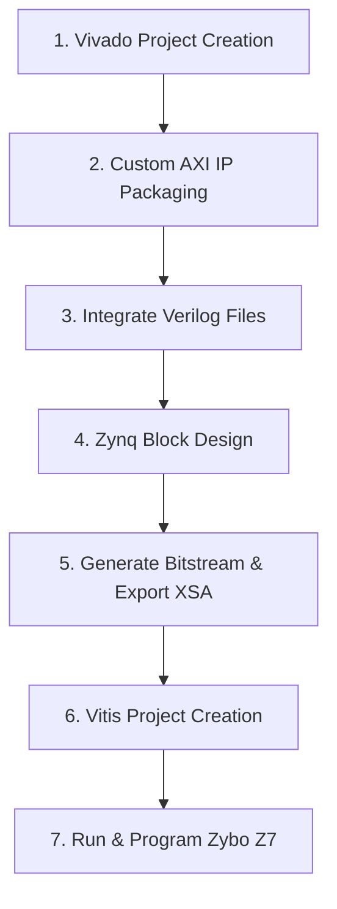

# AES-128 Encryption Accelerator: Vivado & Vitis Tutorial Guide

This guide provides step-by-step instructions for implementing an **AES-128 hardware accelerator** on the **Zybo Z7-10** (Zynq-7000 SoC) using **Xilinx Vivado** and **Vitis**.

We will connect a custom Verilog AES core to the Zynq ARM processor over the AXI4-Lite bus, and write software to control it.

---

## Code Files Generated

Your project files are located in `C:/Users/ashiq/.gemini/antigravity/scratch/aes_zybo_project/`:
- **Hardware HDL Core**: [hdl/aes_128_core.v](file:///C:/Users/ashiq/.gemini/antigravity/scratch/aes_zybo_project/hdl/aes_128_core.v) (Standard iterative AES-128 engine)
- **AXI-Lite Slave Wrapper**: [hdl/aes_axi_lite.v](file:///C:/Users/ashiq/.gemini/antigravity/scratch/aes_zybo_project/hdl/aes_axi_lite.v) (AXI4-Lite register mapping)
- **Vitis Software**: [software/main.c](file:///C:/Users/ashiq/.gemini/antigravity/scratch/aes_zybo_project/software/main.c) (C application to test the accelerator)

---

## Step-by-Step Instructions

### STEP 1: Create a New Vivado Project
1. Open **Xilinx Vivado**.
2. Click **Create Project** (or go to `File -> New Project`). Click **Next**.
3. **Project Name**: Name it `aes_accelerator` and choose a workspace folder. Click **Next**.
4. **Project Type**: Select **RTL Project** and check the box **Do not specify sources at this time**. Click **Next**.
5. **Default Part / Board**:
   * Select the **Boards** tab.
   * Search for **Zybo Z7-10**. (If it's not installed, click the download icon next to it, or select the **Parts** tab and search for `xc7z010clg400-1`).
   * Select it and click **Next**.
6. Review the summary and click **Finish**.

---

### STEP 2: Create a Custom AXI4 Peripheral
To hook our Verilog code to the processor, we will create a custom AXI IP.
1. In Vivado, go to the top menu and select `Tools -> Create and Package New IP...`. Click **Next**.
2. Select **Create a new AXI4 peripheral**. Click **Next**.
3. **Peripheral Details**:
   * **Name**: `aes_coprocessor`
   * **Version**: `1.0`
   * Click **Next**.
4. **Add Interfaces**:
   * **Name**: `S00_AXI`
   * **Type**: `Lite`
   * **Mode**: `Slave`
   * **Data Width**: `32`
   * **Number of Registers**: Increase this to `16` (Since we need 14 registers, 16 is the closest power of 2).
   * Click **Next**.
5. **Create Peripheral**:
   * Select **Edit IP** (this opens a separate temporary Vivado window where we edit the IP files).
   * Click **Finish**.

---

### STEP 3: Add HDL Files to the Custom IP
Now we replace the auto-generated templates in the temporary Edit IP project with our clean Verilog files.
1. In the **Sources** pane of the Edit IP project, you will see two files:
   * `aes_coprocessor_v1_0.v` (Top wrapper)
   * `aes_coprocessor_v1_0_S00_AXI.v` (AXI interface)
2. Double click `aes_coprocessor_v1_0_S00_AXI.v` to open it.
3. Replace its entire contents with the code from **[aes_axi_lite.v](file:///C:/Users/ashiq/.gemini/antigravity/scratch/aes_zybo_project/hdl/aes_axi_lite.v)**. Rename the module inside the file to match the wizard's expected name (e.g. `aes_coprocessor_v1_0_S00_AXI` if it is different).
4. Go to `File -> Add Sources...` (or click `+` in the Sources panel).
   * Select **Add or create design sources** and click **Next**.
   * Click **Add Files** and select **[aes_128_core.v](file:///C:/Users/ashiq/.gemini/antigravity/scratch/aes_zybo_project/hdl/aes_128_core.v)** from your local drive.
   * Make sure **Copy sources into IP directory** is checked. Click **Finish**.
5. Double click `aes_coprocessor_v1_0.v` (the top-level wrapper). We need to hook up the sub-module correctly. Since we changed the address range, replace the template instantiation inside with your new module. In fact, you can just clean up `aes_coprocessor_v1_0.v` so it directly instantiates `aes_coprocessor_v1_0_S00_AXI` and propagates all signals.
6. Open the **Package IP** tab in the main editor pane.
7. Go through all 8 steps in the **Packaging Steps** list (they will have yellow status dots):
   * Click **Identification**, **Customization Parameters**, etc.
   * Click **Merge changes from Customization Parameters Wizard** if a warning appears.
   * Under **Customization Parameters**, right-click `C_S00_AXI_ADDR_WIDTH` and select **Edit Parameter**. Change its default value to `6` if it isn't already (6 bits needed to address 16 registers).
   * Finally, go to the **Review and Package** tab.
   * Click **Re-Package IP**. The temporary Vivado project will close automatically.

---

### STEP 4: Build the Zynq Block Design
Now we tie the processor and our new IP together in a visual schematic.
1. In your main Vivado window, under the Flow Navigator, click **Create Block Design**. Keep the default name and click **OK**.
2. Click the `+` button in the Block Design canvas (or press `Ctrl+I`).
3. Search for **Zynq** and double-click **Zynq7 Processing System** to add it.
4. Click the green banner at the top: **Run Block Automation**.
   * Ensure `Apply Board Preset` is checked (this automatically configures the Zybo's DDR memory and clock settings). Click **OK**.
5. Click the `+` button again, search for `aes_coprocessor` (your custom IP), and add it.
6. Click the green banner at the top: **Run Connection Automation**.
   * Check **All Ports**.
   * Click **OK**.
   * Vivado will automatically insert an AXI Interconnect block and a Processor System Reset block, connecting everything together.
7. Right-click on the block design canvas and select **Regenerate Layout** to make the diagram look clean.
8. Go to the **Address Editor** tab (usually at the top of the canvas). Verify that `aes_coprocessor_0` is mapped. Note down its `Offset Address` (usually `0x43C00000`).
9. Select the **Sources** tab, right-click on your block design (e.g. `design_1.bd`), and select **Create HDL Wrapper**.
   * Select **Let Vivado manage wrapper and auto-update**. Click **OK**.

---

### STEP 5: Generate Bitstream and Export Platform
1. In the Flow Navigator (left-hand sidebar), click **Generate Bitstream**.
   * If Vivado prompts you to run synthesis and implementation first, click **Yes**.
   * Wait for compilation to complete (this will take a few minutes).
2. Once complete, select **Open Implemented Design** or close the pop-up.
3. Export the hardware configuration:
   * Go to `File -> Export -> Export Hardware...`. Click **Next**.
   * Choose **Include bitstream**. Click **Next**.
   * Set the name (e.g. `aes_wrapper.xsa`) and note where it is exported. Click **Next**, then **Finish**.

---

### STEP 6: Set Up Vitis & Import Hardware Platform
1. In Vivado, select `Tools -> Launch Vitis IDE` (or launch Vitis from your Windows Start menu).
2. Choose a clean directory for your software workspace and click **Launch**.
3. Create the platform project:
   * Click **Create Platform Project** (or `File -> New -> Platform Project`).
   * **Project Name**: `aes_platform`
   * Under **Hardware Specification**, browse and select the `.xsa` file exported in STEP 5.
   * Click **Finish**.
   * In the platform project settings, click the **Hammer** icon in the toolbar (or right-click `aes_platform` and choose `Build Project`) to compile the Board Support Package (BSP).
4. Create the application project:
   * Go to `File -> New -> Application Project`. Click **Next**.
   * Select your hardware platform: `aes_platform`. Click **Next**.
   * **Target Processor**: Select `ps7_cortexa9_0`. Click **Next**.
   * **System Project**: Accept defaults. Click **Next**.
   * **Domain**: Accept defaults (`standalone_ps7_cortexa9_0`). Click **Next**.
   * **Template**: Select **Empty Application (C)**. Click **Finish**.

---

### STEP 7: Import C Code and Run
1. In Vitis, expand your application project (e.g., `aes_app`) and locate the `src` folder.
2. Right-click the `src` folder and select **Import Sources...** or simply copy and paste the generated **[main.c](file:///C:/Users/ashiq/.gemini/antigravity/scratch/aes_zybo_project/software/main.c)** file into it.
3. Build the application project by clicking the **Hammer** icon.
4. **Connect your Zybo Z7-10 board**:
   * Connect the micro-USB cable from the Zybo's PROG/UART port to your PC.
   * Ensure jumper **J15** is set to **JTAG** mode.
   * Turn the power switch on.
5. **Configure a Serial Console**:
   * You can open a terminal inside Vitis (Window -> Show View -> Terminal) or use an external tool like PuTTY, Tera Term, or MobaXterm.
   * Connect to the Zybo's COM Port (e.g., COM3, COM4) at **115200 Baud Rate**.
6. **Program and Run**:
   * Right-click your application project (`aes_app`).
   * Select **Run As -> Launch Hardware (Single Application Debug)**.
   * Vitis will program the FPGA fabric with the bitstream, load the C code into the Zynq processor, run the code, and print the results to your terminal console!
