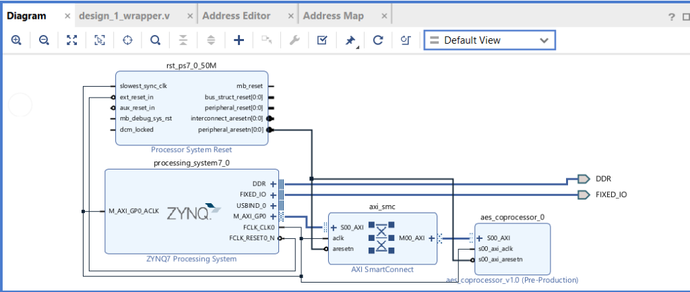
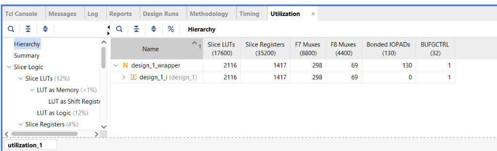
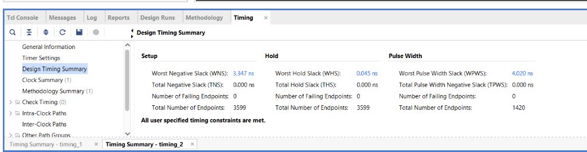
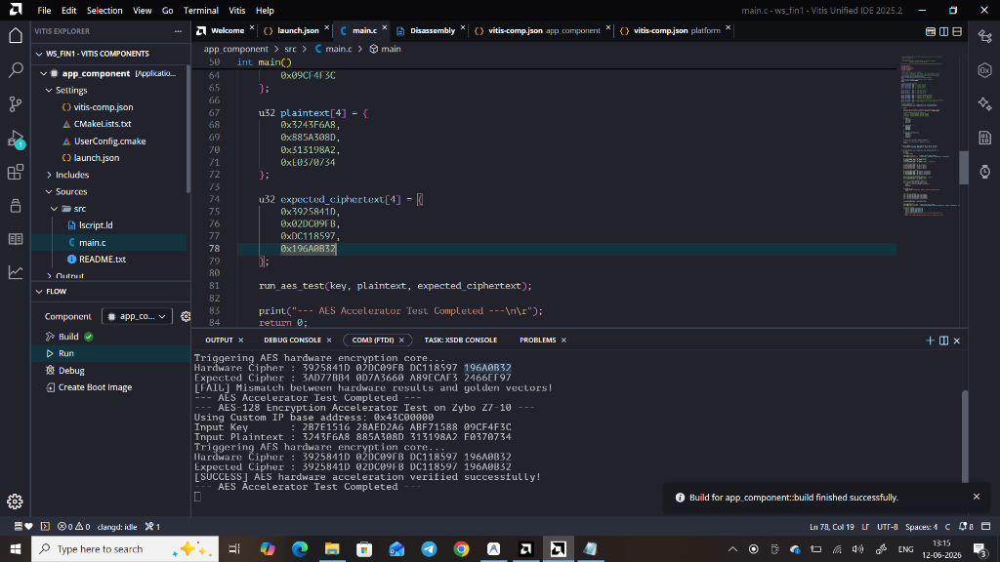

# AES-128 Encryption Accelerator for Zynq SoC (Zybo Z7-10)

This repository contains the hardware and software files for an **AES-128 encryption accelerator** implemented on the **Zybo Z7-10 (Zynq-7000 ARM/FPGA SoC)**. 

The design integrates a custom iterative Verilog AES-128 engine with the Zynq Processing System (ARM Cortex-A9) over the memory-mapped AXI4-Lite bus, verified using a bare-metal C application.

---

## Key Features
* **Custom AES-128 Engine:** Fully iterative Verilog implementation encrypting a 128-bit block in 11 clock cycles.
* **AXI4-Lite Register Interface:** 16 memory-mapped registers mapping the input key (128-bit), plaintext (128-bit), ciphertext (128-bit), control (start/reset), and status (ready/done flags).
* **Hardware/Software Co-Design:** System architecture utilizes Xilinx Vivado for IP packaging/SoC block design and Vitis Unified IDE for software development and verification.
* **Optimized Footprint:** Lightweight FPGA resource footprint suitable for space-constrained edge applications.

---

## Directory Structure
* **`hdl/`**: Verilog source files.
  * [aes_128_core.v](hdl/aes_128_core.v) - Standard iterative AES-128 round execution engine.
  * [aes_axi_lite.v](hdl/aes_axi_lite.v) - AXI4-Lite slave wrapper handling register decoding and processor interfacing.
* **`software/`**: C applications.
  * [main.c](software/main.c) - Bare-metal C test code to write plaintext/key, trigger execution, read back ciphertext, and verify against golden vectors.
* **`images/`**: Synthesis, implementation, and verification output screenshots.

---

## Hardware Architecture & Block Design
The hardware layout maps the custom `aes_coprocessor_0` peripheral to the `processing_system7_0` (Zynq ARM Core) using the high-performance `AXI SmartConnect` (`axi_smc`) interconnect. The `rst_ps7_0_50M` block synchronizes reset signals with the processor's clock domain.



---

## Implementation & Verification Results

### 1. Resource Utilization
The resource utilization statistics show a lightweight implementation footprint on the Zybo Z7-10 (xc7z010clg400-1) at synthesis/implementation:

| Resource | Used | Available | Utilization % |
| :--- | :--- | :--- | :--- |
| **Slice LUTs** | 2,116 | 17,600 | 12.02 % |
| **Slice Registers** | 1,417 | 35,200 | 4.03 % |
| **F7 Muxes** | 298 | 8,800 | 3.39 % |
| **F8 Muxes** | 69 | 4,400 | 1.57 % |
| **Bonded IOBs** | 130 | 130 | 100.00 % |
| **BUFGCTRL** | 1 | 32 | 3.13 % |



### 2. Timing Summary
All user-specified timing constraints were fully met at the target frequency (50 MHz clock):

* **Worst Negative Slack (WNS):** `3.347 ns` (Met)
* **Worst Hold Slack (WHS):** `0.045 ns` (Met)
* **Worst Pulse Width Slack (WPWS):** `4.020 ns` (Met)
* **Total Negative Slack (TNS):** `0.000 ns`
* **Total Hold Slack (THS):** `0.000 ns`



### 3. Hardware Acceleration Verification
When running the software application in Vitis, the system initiates the encryption core, writes the key and plaintext to the memory-mapped AXI registers, triggers execution, and compares the resulting ciphertext with the golden standard AES vectors.

```
--- AES-128 Encryption Accelerator Test on Zybo Z7-10 ---
Using Custom IP base address: 0x43C00000
Input Key       : 2B7E1516 28AED2A6 ABF71588 09CF4F3C
Input Plaintext : 3243F6A8 885A308D 313198A2 F0370734
Triggering AES hardware encryption core...
Hardware Cipher : 3925841D 02DC09FB DC118597 196A0B32
Expected Cipher : 3925841D 02DC09FB DC118597 196A0B32
[SUCCESS] AES hardware acceleration verified successfully!
--- AES Accelerator Test Completed ---
```


